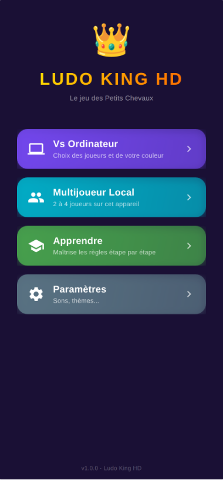
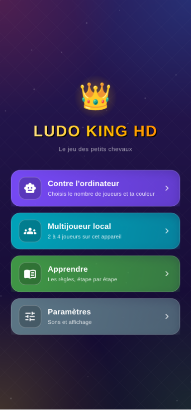
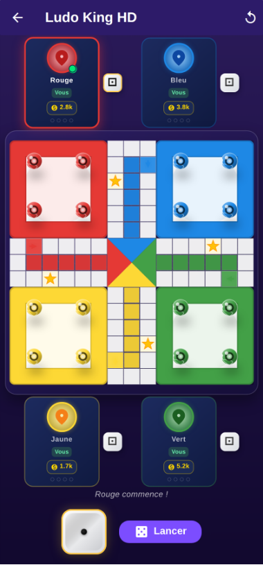
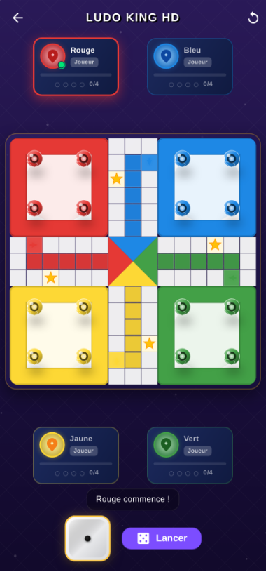
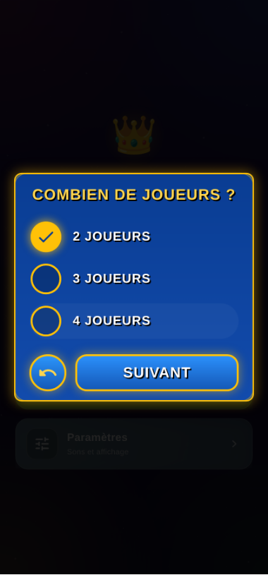

# L'interface

## Où vivent les décisions visuelles

- `lib/theme/app_theme.dart` — les couleurs, la police d'affichage, et le
  `ThemeData` de l'app. Aucun écran ne doit réécrire un `Color(0xFF…)` de son
  côté : avant, le menu, les dialogues et la partie n'avaient ni le même
  violet ni le même or, et les dialogues du système sortaient en clair sur
  une app sombre.
- `lib/widgets/app_background.dart` — le fond commun : dégradé de nuit, halos
  aux quatre couleurs du jeu, trame de losanges. Tout est peint, le dépôt ne
  porte aucune image.
- `lib/widgets/arcade.dart` — le style « arcade » des dialogues : cadre bleu à
  liseré doré, grosses pastilles, boutons. Ces briques étaient privées au
  menu, ce qui laissait les autres dialogues en Material par défaut.

## La police

`google_fonts` télécharge *Luckiest Guy* au premier lancement. Sans réseau,
Flutter retombe sur la police système : l'app reste lisible, mais le titre
n'a pas la bonne allure et la mise en page bouge un peu. Pour y couper, il
faut versionner le `.ttf` dans `assets/fonts/`, le déclarer dans
`pubspec.yaml`, et changer `AppText.display` — qui est le seul endroit du
code où la police est nommée.

## Avant / après

| | Avant | Après |
| --- | --- | --- |
| Menu |  |  |
| Partie |  |  |

Le dialogue de choix, désormais le même partout :

Les captures viennent de la version web (`flutter build web --web-renderer
html`), prise à 380 × 814. La police d'affichage y est celle de repli,
faute de réseau au moment de la capture.

## Ce qui a été corrigé en même temps

- Chaque joueur affichait une cagnotte en pièces, tirée d'une constante par
  couleur et jamais modifiée. Remplacée par l'avancée réelle du joueur.
- Les quatre cartes affichaient le même dé, celui du joueur en cours. Le dé
  ne suit plus que celui qui vient de le lancer.
- En multijoueur local, les quatre joueurs étaient marqués « Vous ». Le
  badge distingue maintenant « Vous », « Joueur » et « IA ».
- « Aucun coup possible » et « trois 6 de suite » étaient écrits puis
  aussitôt écrasés par « Tour de X. » : le joueur ne savait jamais pourquoi
  son tour s'arrêtait.
- Le type de joueur était comparé par le nom de sa valeur (`type.name ==
  'human'`), ce qu'un simple renommage aurait cassé sans erreur de
  compilation.
- Contre l'ordinateur, le choix 3 joueurs n'existait pas, et le calcul des
  couleurs en aurait de toute façon mis quatre sur le plateau.
